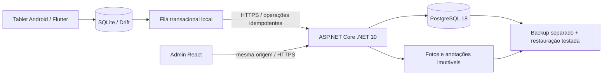

# Arquitetura

`mobile/` contém domínio de inspeção, persistência, sessão, sincronização e telas. `backend/` separa domínio, infraestrutura EF e endpoints. `admin-web/` consome a mesma API. `infrastructure/` e `scripts/` definem execução local e caminho de implantação. `IMPLEMENTATION_CONTRACT.md` define DTOs e comportamentos compartilhados.

A fronteira de confiança fica no servidor. Identidade, empresa, unidade, papel e versões são validados na API. Cliente não pode declarar-se administrador nem selecionar arbitrariamente outro escopo. O banco mantém recibos de idempotência e auditoria persistentes.

Para sincronização, salvar estado local precede tentativa de rede. Uma operação já tentada não muda de conteúdo. Requisições subsequentes respeitam a versão prevista; conflito interrompe apenas o envio daquela inspeção e preserva o trabalho. Inspeções independentes e anexos já declarados continuam. O usuário vê salvamento local e sincronização como estados diferentes.

Publicação de template cria uma versão congelada; cada inspeção usa a versão exata. Imutabilidade após finalização permite histórico auditável. Upload tardio dos bytes de anexos já declarados não modifica respostas ou a lista finalizada.

O desenvolvimento local usa dados sintéticos e portas loopback. O servidor corporativo não foi alterado. Decisões materiais estão em `../decisions/`.
