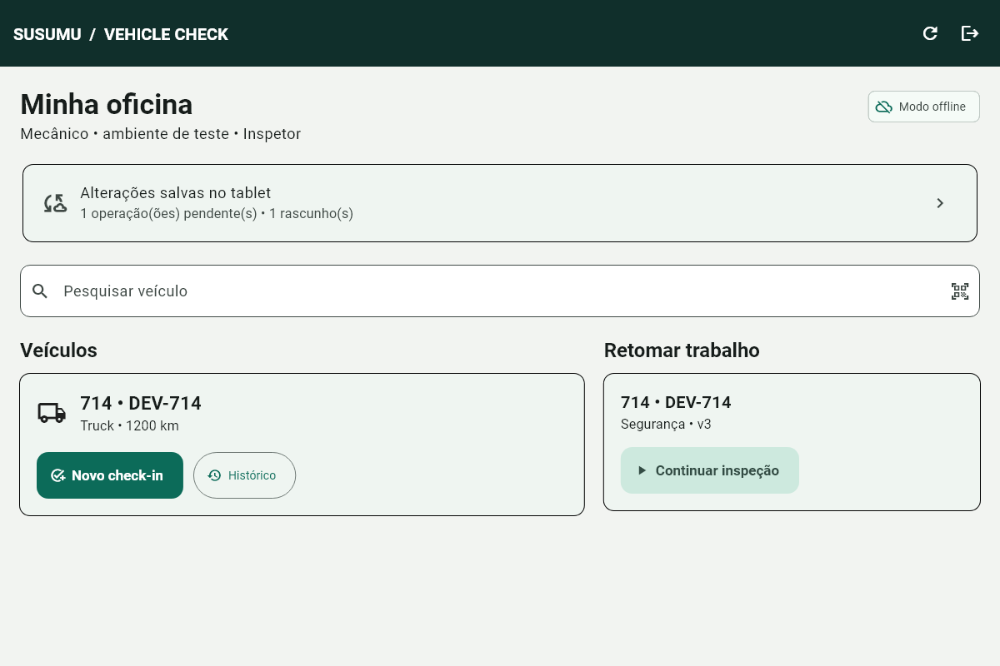
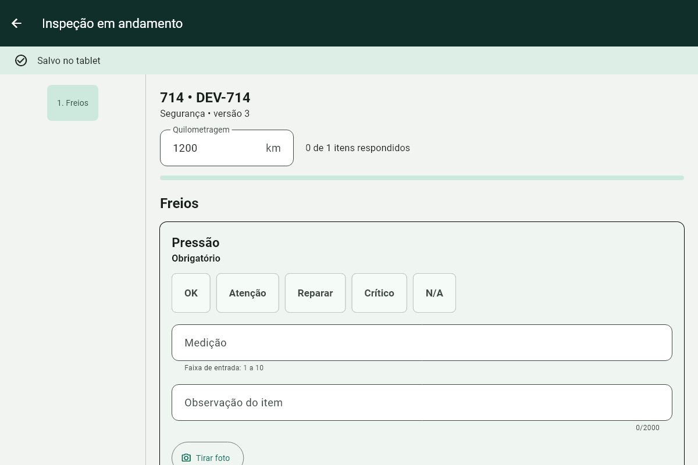
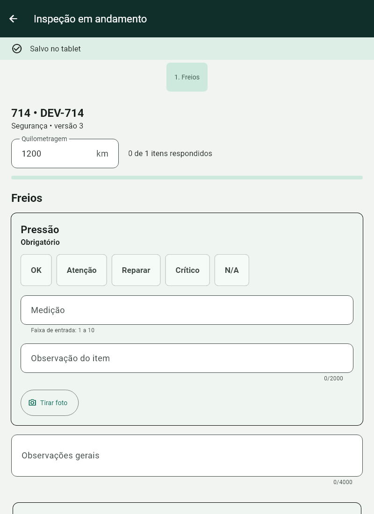

# Primeiro uso — SUSUMU VEHICLE CHECK

Wagner, comece pelo painel no computador. O aplicativo Android será validado no Galaxy quando ele chegar. Use somente os veículos e registros sintéticos do ambiente DEV nesta avaliação.

## Abrir a demonstração no Windows

No PowerShell deste computador:

```powershell
Set-Location 'C:\Users\Pc Forex 2025\OneDrive - 株式会社ススム\Particular\CODEX\_GPT'
.\scripts\start-local.ps1
```

Quando aparecer `DEV ready`, abra [o painel local](http://127.0.0.1:5173). Esse é o painel do escritório; o aplicativo da oficina é o APK Android.

Abra as credenciais **apenas localmente**, no computador autorizado:

```powershell
notepad .\.local\local-runtime-secrets.json
```

No login, use os valores dos campos `adminUsername` e `adminPassword`. Feche o arquivo após consultar. Não envie esse JSON, sua senha ou capturas dele ao GitHub, chat ou outras pessoas; o arquivo também contém configuração privada. Nenhuma senha aparece neste guia.

1. Entre em **Veículos**, pesquise **714** e abra o cadastro de teste.
2. Confira número interno, placa, quilometragem e histórico. O QR mostrado identifica esse cadastro; **Imprimir identificação** prepara a identificação para impressão.
3. Em **Checklists**, examine uma versão publicada para o tipo desse veículo. O aplicativo usa versões publicadas, e cada inspeção preserva a versão escolhida.
4. Em **Inspeções**, acompanhe os registros enviados e a situação das fotos. Um rascunho que ainda está offline no tablet aparecerá após sincronizar.

Para encerrar a demonstração:

```powershell
Set-Location 'C:\Users\Pc Forex 2025\OneDrive - 株式会社ススム\Particular\CODEX\_GPT'
.\scripts\stop-local.ps1
```

O script preserva banco, fotos e credenciais. Se houver erro ao iniciar, registre a mensagem; não apague `.local`, banco ou fotos para tentar corrigir.

## Quando o tablet chegar

O APK de avaliação está em:

```text
C:\Users\Pc Forex 2025\OneDrive - 株式会社ススム\Particular\CODEX\_GPT\mobile\build\app\outputs\flutter-apk\app-debug.apk
```

Transfira esse APK para o tablet e instale pelo procedimento de teste autorizado. O aplicativo se chama **SUSUMU Check**. Esse APK é DEV; distribuição corporativa assinada é uma etapa separada.

Antes do login, prepare um servidor DEV com **HTTPS válido e endereço alcançável pelo Wi-Fi do tablet**. No campo **Servidor HTTPS**, informe somente a origem, sem `/api/v1`. Use uma conta autorizada desse mesmo ambiente. Não existe endereço HTTPS corporativo pronto declarado neste guia.

**`localhost` e `127.0.0.1` no tablet apontam para o próprio tablet.** Os scripts Windows atuais escutam somente no computador; seus endereços locais não são a configuração de rede do tablet. A conexão de teste via HTTPS precisa ser preparada antes da aceitação física.

Faça o primeiro login conectado para baixar veículos e checklists. A sessão permite trabalhar offline por até 72 horas após o login online; o aplicativo informa quando é necessário entrar novamente.

## Fazer uma inspeção do veículo 714

1. Em **Minha oficina**, pesquise `714` ou toque no ícone de QR e leia a identificação do veículo. Confira a placa antes de continuar.
2. Toque em **Novo check-in**, escolha o checklist publicado e informe a quilometragem inteira correta. Toque em **Iniciar inspeção**.
3. Percorra as seções. Marque **OK**, **Atenção**, **Reparar**, **Crítico** ou **N/A** conforme a avaliação; preencha medições e observações aplicáveis. Aguarde **Salvo no tablet**. Se sair antes de finalizar, retome por **Continuar inspeção**.
4. Use **Tirar foto**. O original fica preservado. Para marcar um problema, toque em **Anotar**, desenhe com dedo/S Pen e escolha **Salvar cópia**. A imagem anotada é separada do original.
5. Use **Assinar inspeção**, confira os traços e toque em **Salvar assinatura**. É opcional quando o checklist permitir e obrigatória quando sua versão exigir. A assinatura salva é preservada separadamente.
6. Toque em **Finalizar inspeção**. Corrija os campos apontados, revise e escolha **Confirmar finalização**. O registro finalizado fica imutável; finalizar no tablet ainda pode deixar envio pendente.
7. Volte à tela inicial e abra **Ver fila e conflitos**. Use **Tentar sincronizar agora** quando conectado. Confira operações, fotos e assinatura. **Tudo sincronizado** exige que as pendências tenham sido confirmadas.
8. Abra **Histórico** no veículo. Há registros locais e páginas do servidor; **Carregar mais registros** busca os mais antigos. Offline, somente registros e páginas já salvos estão disponíveis. Os detalhes usam o nome e a versão exata do checklist quando sua definição está em cache.

## Se aparecer conflito ou falha

Uma operação rejeitada fica preservada e bloqueia somente sua inspeção. Outros envios continuam. Não desinstale o aplicativo nem limpe seus dados para resolver a fila.

Na linha **Revisão necessária**, o ícone de cópia oferece **Criar cópia para revisão**. Informe o motivo. A cópia recebe outro ID, mantém a referência da origem e exige nova assinatura quando aplicável; o original e sua operação rejeitada permanecem intactos. **Confira primeiro o histórico do servidor**, pois a origem pode já ter sido recebida. Revise campos e fotos e confirme essa conferência antes de finalizar a cópia.

Para uma inspeção já finalizada e aceita que precisa de correção, use **Criar correção com histórico** no registro. Isso também cria outro registro ligado à origem; não altera o original.

Se houver aviso de foto não recuperável ou erro de armazenamento, confira os anexos e registre a mensagem. Uma captura perdida precisa ser refeita; um arquivo preservado com vínculo pendente deve ser recuperado na sessão do proprietário.

## Aceitação física pendente

Estes testes ainda precisam ser executados no Galaxy, com contas e dados DEV:

- [ ] Identificar o 714 por pesquisa e QR; conferir câmera, permissões, lanterna e orientação vertical/horizontal.
- [ ] Após login e download do catálogo, ativar modo avião; preencher itens, medição, notas, foto, anotação e assinatura. Confirmar **Salvo no tablet**.
- [ ] Fechar/reabrir o aplicativo e reiniciar o tablet. Retomar e conferir valores, textos, originais e anotações, sem perder registros.
- [ ] Voltar ao Wi-Fi, sincronizar e conferir a mesma inspeção no painel. Interromper a rede durante o envio e retentar; verificar ausência de duplicatas e recebimento das fotos.
- [ ] Sair preservando rascunhos, entrar com outro operador DEV e verificar isolamento. Voltar ao primeiro operador e retomar seu trabalho.
- [ ] Testar câmera interrompida/reabertura e retorno do aplicativo. Conferir a recuperação na conta correta, inclusive após troca de operador.
- [ ] Testar S Pen, toque, luvas, conforto dos controles e contato da palma. Verificar que anotar não altera o original e que a assinatura permanece legível.
- [ ] Exercitar uma rejeição controlada com o responsável técnico, revisar a fila e criar uma cópia sem apagar a origem.

Registre o resultado e a versão do APK. Compilação e testes automatizados não comprovam esses comportamentos no hardware físico.

## Prévia visual do aplicativo

As três imagens abaixo são **renders reais de widgets Flutter em teste, com dados sintéticos**. Não são fotografias nem capturas de um tablet físico.







Detalhes técnicos: [Android](../mobile/README.md), [testes](TESTING.md) e [implantação/rede](DEPLOYMENT.md).
